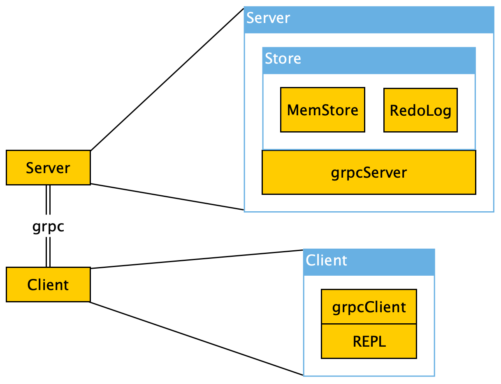
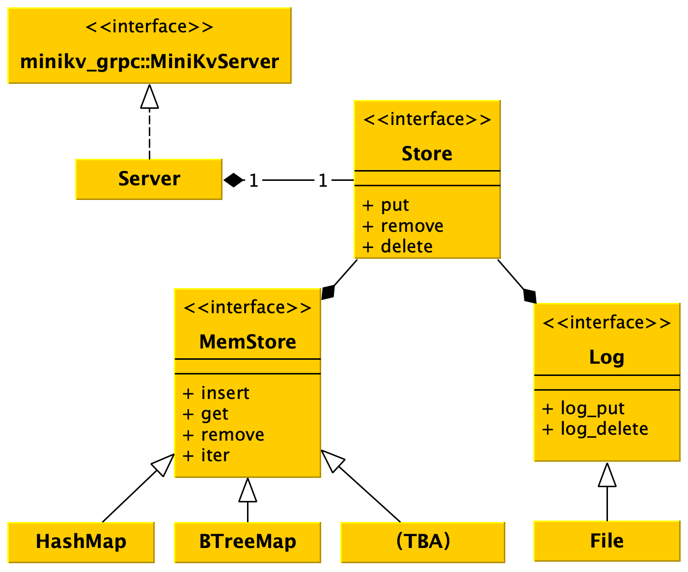

# Design considerations

## Architecture

As the image shows, this is a stadard Client-Server architecture. The server and the client(s) communicate with each other with grpc.

The server contains a grpcServer component and a store, which is made up of in-memory store component and logging component.

The client is a redis-cli-like tool, it just gives us a repl interface to do CRUD on the data on the server.

## Why grpc

When I met up with the problem, three kind of communation protocols came into my mind:

- grpc
- plain http
- hand-written protocal

Finally, I decided to use grpc for these reasons:

- grpc provides a language-independent interface, so if I need a, for example, Golang client, I can just generate go code with the `.proto` without writing much code, this beats hand-written protocal.
- Generally speaking, grpc's performace is better than plain http. And it is more convenient to transmit both meta-data and binary data together with grpc.
- Tikv uses grpc, which is, after all, I wrote all these things for

But there's also some drawbacks of grpc：

- The rust code generate by [grpc-rs](https://github.com/tikv/grpc-rs.git) depedends on `futures 0.1`, but I'm more accustomed to `futures 0.3`, so I have to add a lot of `compat` in the code, and some features like muteness of `futures 0.3` is not directly offered in 0.1, it made writing the code a little annoying.[^1]

## Server

[^1]: Or am I useing the grpc-rs in the wrong way?